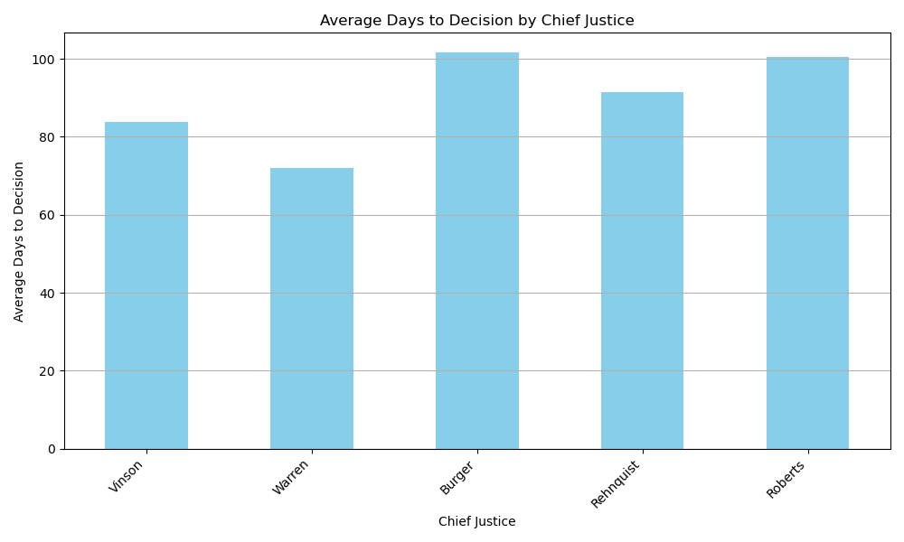
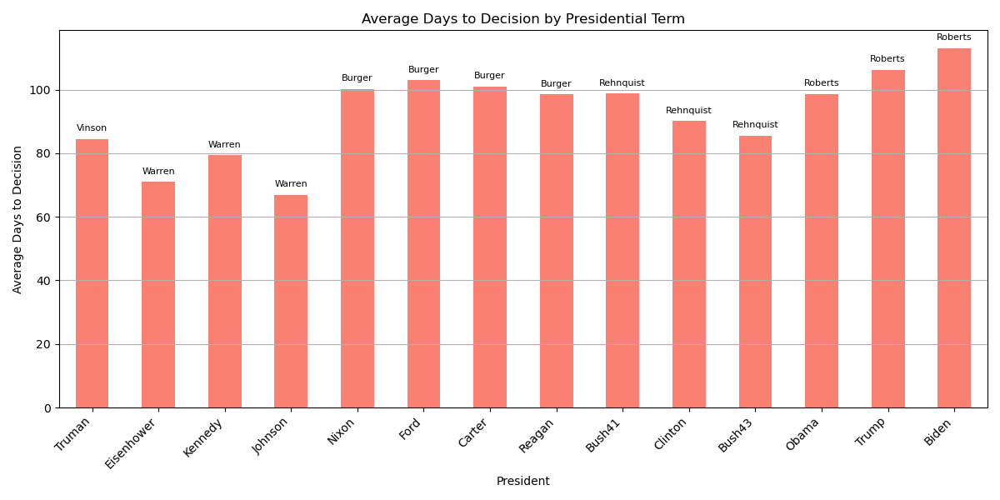
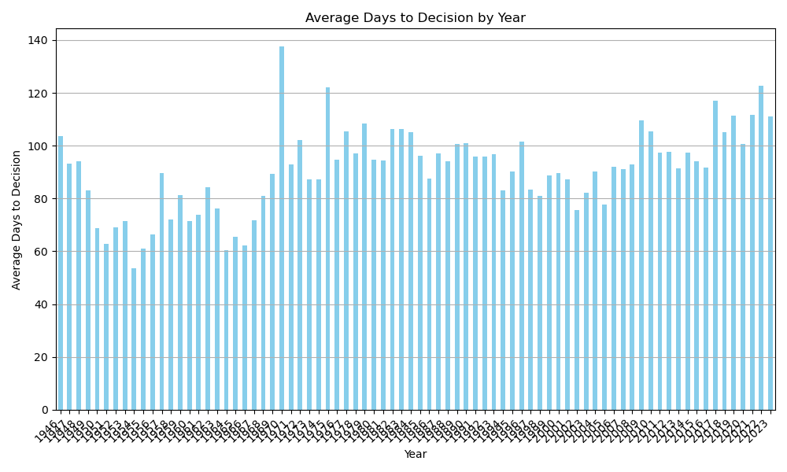
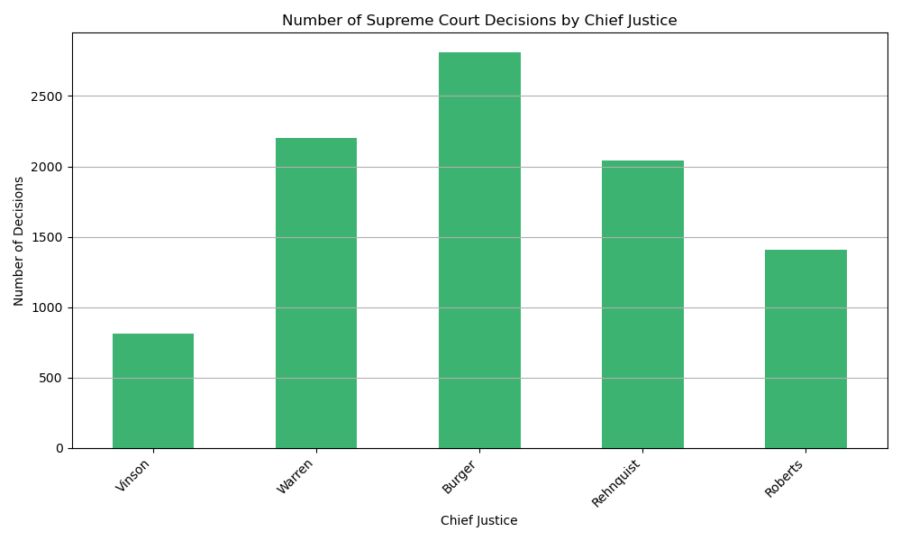
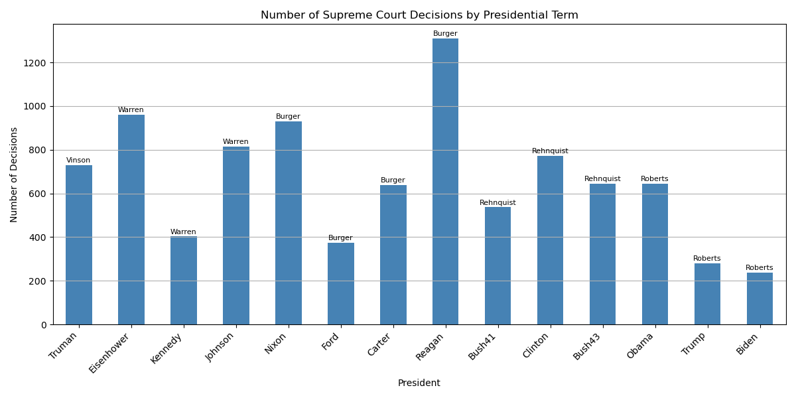
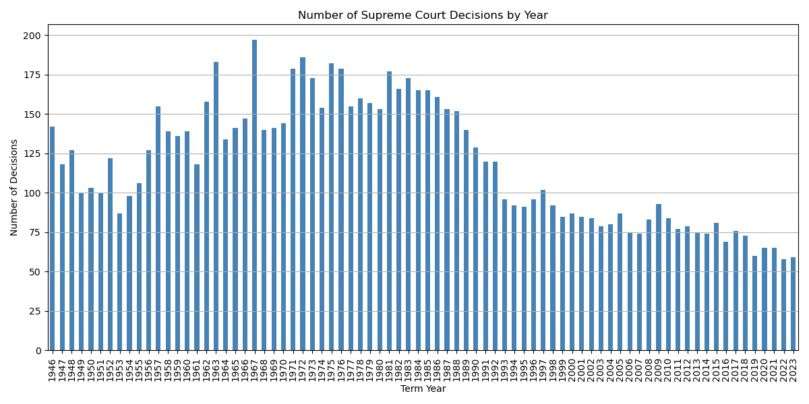
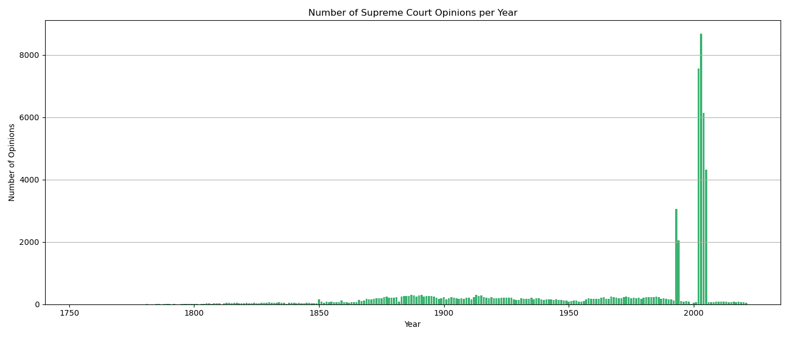

# Case Overload in the Judicial Branch

This repository contains analysis and visualization scripts for a political science capstone project investigating whether the U.S. judicial branch—specifically the Supreme Court—can be overwhelmed by the executive (or other branches) via caseload. The project explores trends in Supreme Court opinions, decision times, and their relationship to presidential and judicial leadership eras.

## Project Overview

The main questions addressed are:
- Has the Supreme Court's caseload changed over time?
- How have opinion lengths and the time taken to reach decisions evolved?
- Are there patterns in caseload or decision times by presidential term or Chief Justice?

## Figures

### Average Days to Decision




### Decisions




### Opinions


## Repository Structure

- **Python Scripts**:
  - `opinions.py`: Processes and summarizes raw Supreme Court opinion text and word counts by year.
  - `plot_opinion_length.py`: Visualizes the average opinion length per year.
  - `plot_opinion_count.py`: Plots the number of Supreme Court opinions per year.
  - `count_of_decisions_by_year.py`: Charts the number of Supreme Court decisions by year.
  - `count_of_decisions_by_chief.py`: Visualizes decisions grouped by Chief Justice.
  - `count_of_decisions_by_pres_term.py`: Plots decisions grouped by presidential term.
  - `time_to_decision_by_year.py`: Examines average days from argument to decision by year.
  - `time_to_decision_by_chief.py`: Looks at decision times by Chief Justice.
  - `time_to_decision_by_pres_term.py`: Analyzes decision times by president.

- **Data**:
  - Data files such as `courtdata/supreme_court_opinion_lengths.csv` and `scdata/SCDB_2024_01_caseCentered_Citation.csv` are used as inputs for the scripts.
  - These files are expected to contain annual counts, word counts, or detailed case information.

## Dependencies

- Python 3.x
- pandas
- matplotlib

You can install the dependencies using pip:
```bash
pip install -r requirements.txt
```

## Usage

1. **Prepare Data**: Place the required CSV files in the specified directories (`courtdata/`, `scdata/`).
2. **Run Scripts**: Execute any of the Python scripts to generate visualizations or summaries. For example,
   ```bash
   python plot_opinion_length.py
   ```
   Adjust the file paths in each script if your data files are stored elsewhere.

## Example Analyses

- Track how the average opinion length has changed over time.
- Visualize how the number of Supreme Court decisions fluctuates by year, by Chief Justice, or by president.
- Analyze the average time to decision and how it varies across different eras.

## Notes

- For more information or to see additional scripts, visit the [GitHub repository](https://github.com/Jon-Hurley/491-work).

---
